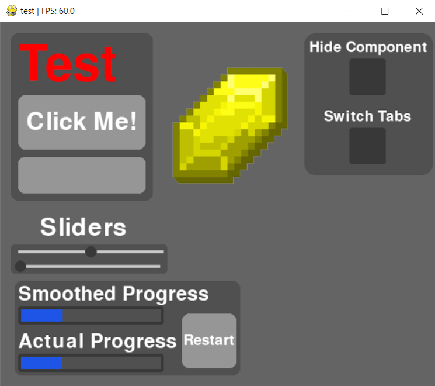

# Ui engine

Easiest ui engine ever???

Fuck compex ass layout managers we have position control :fire:

(tbh might still add them)

## Documentation

### Components List

- Frame       - Literally just a frame
- Text        - Literally just text
- Button      - Text but with a rectangle arround it*
- TextBox     - You can type shit*
- Image       - Just displays an image thats it
- ProgressBar - Best progress bar you've ever seen
- CheckBox    - A checkbox. Can be on or off thats it.*
- Slider      - Just a slider*
- Tab         - Allows you to make tabs easily
- Area        - Literally just colored rectangle.
- Line        - Literally just a line.

(* = has callback)

Please spam ping me on discord so i get motivation to add more

Yes i will regret this if the repo gets popular.

And yes i still will do it anyways.

### Root

The root is the actual window that components get added to.

To create the window you must call the .show() method.

The root takes 2 attributes:

- Title   - str
- BgColor - r,g,b (default=100,100,100)

You can set the window title with root.setTitle()

To add components, call component.add(parent)

You can set the current tab with root.setTab(tab)

### Components (detailed)

### Frame

Lets you add other objects into it.

Can be used with .add()

#### Attributes

- Position - x,y
- Width    - int
- Height   - int

### Text

Literally just text

#### Attributes

- Position - x,y
- Text     - str
- Size     - int   (font size)
- Color    - r,g,b (text color)
- Font     - str   (default Roboto)

### Button

A button.

#### Attributes

- position      - x,y
- width         - int
- height        - int
- text          - str
- size          - int (font size)
- action        - Callable
- color         - r,g,b (button color)
- hover_color   - r,g,b
- font_color    - r,g,b
- font          - str (default Roboto)
- corner_radius - int

### TextBox

Box that you can type in. Not really advanced but it works.

Has a callback that gets called
with the current text whenever the text is changed.

- position    - x,y
- width       - int
- height      - int
- size        - int (font size)
- color       - r,g,b
- focus_color - r,g,b (color when in focus)
- hover_color - r,g,b (color when mouse hover)
- font_color  - r,g,b
- font        - str (default roboto)
- text        - str
- on_type     - Callable (called whenever key entered)

### Image

Basic image.

#### Attributes

- position   - x,y
- image_path - str

### ProgressBar

The best progress bar you have and will ever see.

If you want to smooth the movement of the progressbar,
call .start() when you start the operation.

The progressbar will automatically increase based on the speed attribute,
and slow down when its getting too far
from the last set value.

It will eventually stop.

You should set the speed attribute to a value where the
progressbar doesent stop and its speed
stays somewhat the same

#### Attributes

- position      - x,y
- width         - int
- height        - int
- color         - r,g,b
- border_color  - r,g,b
- border_radius - int
- corner_radius - int
- speed         - int

### CheckBox

Just a checkbox

#### Attributes

- position       - x,y
- width          - int
- height         - int
- color          - r,g,b
- hover_color    - r,g,b
- check_color    - r,g,b
- corner_radius  - int
- checked        - bool
- action         - Callable

### Slider

A slider.

#### Attributes

- position      - x,y
- width         - int
- height        - int
- color         - r,g,b
- handle_color  - r,g,b
- handle_radius - int
- track_color   - r,g,b
- track_height  - int
- action        - Callable

### Area

A colored rectangle with rounded corners

#### Attributes

- position      - x,y
- width         - int
- height        - int
- color         - r,g,b
- corner_radius - int

### Line

A line from point a to point b.

#### Attributes

- from_ - x,y
- to    - x,y
- color - r,g,b

### Tab

Lets you switch tabs.

You can add objects to it just like a frame or root.

Tab's children are not rendered unless the current tab is equal to the tabs id.

The id's start from 0 and go up.

You can set the tab with root.setTab(tab)

## Methods (Universal)

Here are all the methods that exist for every single component. (including root)

Basically all methods return self

This is just for convinience reasons.

### comp.add(parent,layer=0)*

Adds a component to a parent and sets layer. (layer is optional)

### comp.setPos(x,y)*

Changes the position of component

(* = Returns self) <!--You're welcome, i love syntax!-->

## Internal methods

Dont use theese!

This is only documented if you want to add custom components.

### comp.event(event)

Used internally for events, like mouse moving.

### comp.tick(frame)

Called every second frame (performance reasons)

## Example

### Example UI (uses most components)



### Code

The code is a bit long, but you can collapse
them in vscode and it'll look alot better.

```python
import engine
from RGBRotate import RGBRotate

root = engine.Root('test')

tab1 = engine.Tab().add(root,-10)
tab2 = engine.Tab().add(root,-10)

area1 = engine.Area(
    position=(15,15),
    width=195,
    height=230,
    color=(80,80,80),
    corner_radius=10
).add(tab1,-1)

txt = engine.Text(
    position=(25,25),
    text='Test',
    size=100,
    color=(255,0,0)
).add(tab1,1)

button = engine.Button(
    position=(25,100),
    width=175,
    height=75,
    text='Click Me!',
    size=50,
    action=lambda: button.setPos(button.x+10,button.y)
).add(tab1,0)

tb = engine.TextBox(
    position=(25,185),
    width=175,
    height=50,
    size=30,
    action=lambda txt: print(f'\r{txt}',end=' ')
).add(tab1)

area2 = engine.Area(
    position=(20,355),
    width=310,
    height=130,
    color=(80,80,80),
    corner_radius=10
).add(tab1,-1)

pb1_txt = engine.Text(
    position=(25,360),
    text='Smoothed Progress',
    size=40
).add(tab1)

pb1 = engine.ProgressBar(
    position=(25,390),
    width=200,
    height=25,
    corner_radius=3,
    speed=25
).add(tab1,0)

pb2_txt = engine.Text(
    position=(25,425),
    text='Actual Progress',
    size=40
).add(tab1)

pb2 = engine.ProgressBar(
    position=(25,455),
    width=200,
    height=25,
    corner_radius=3,
    speed=0
).add(tab1,0)

def r():
    global a
    pb1.setProgress(0,100)
    pb2.setProgress(0,100)
    pb1.progress = 0
    a = 0

restart = engine.Button(
    position=(250,400),
    width=75,
    height=75,
    text='Restart',
    size=30,
    action=r
).add(tab1)

img = engine.Image(
    position=(0,0), # Pos overridden by slider
    image_path='src/img.png'
).add(tab1,1)

def a(_):
    txt.visible = not txt.visible

area3 = engine.Area(
    position=(418,15),
    width=177,
    height=195,
    color=(80,80,80)
).add(tab1,-1)

cb1_txt = engine.Text(
    position=(425,25),
    text='Hide Component',
    size=30
).add(tab1,1)

cb1 = engine.CheckBox(
    position=(480,50),
    width=50,
    height=50,
    action=a
).add(tab1,1)

cb2_txt = engine.Text(
    position=(445,120),
    text='Switch Tabs',
    size=30
).add(root,1)

cb2 = engine.CheckBox(
    position=(480,145),
    width=50,
    height=50,
    action=lambda x: root.setTab(x)
).add(root,1)

slider_txt = engine.Text(
    position=(55,265),
    text='Sliders',
    size=50
).add(tab1)

area4 = engine.Area(
    position=(15,305),
    width=215,
    height=40,
    color=(80,80,80),
    corner_radius=5
).add(tab1,-1)

slider = engine.Slider(
    position=(25,305),
    width=200,
    height=20,
    action=lambda pos: img.setPos(pos*slider.width*2,25)
).add(tab1)

slider2 = engine.Slider(
    position=(25,325),
    width=200,
    height=20,
    action=lambda pos: slider2.setPos(round(20+pos*(slider2.width/1.3)),slider2.y)
).add(tab1)

slider.setValue(0.5)
slider2.setValue(0.0)

pb1.start()

root.show()

rgb = RGBRotate()
rgb.set_hue_rotation(15)

a:int = 0
while engine.update():
    if txt.visible and a % 5 == 0: txt.color = rgb.apply(*txt.color)
    if pb1.realProg < 1 and a%50==0:
        pb1.setProgress(a/4)
        pb2.setProgress(a/4)
    a += 1
```
